<div align="center">

# VERIFAI

### Autonomous Software Verification Lab

**Connect a repo. Let AI agents test it like the real world will. See the evidence. Verify the fix.**

VERIFAI turns a repository into a controlled verification run: specialist agents investigate security, APIs, browser behavior, user journeys, failures and regressions inside isolated execution environments, preserve evidence, and only call a fix verified after it survives targeted and regression checks.

<video src="assets/verifai-deep-audit.mp4" autoplay muted loop playsinline controls width="100%"></video>

### [Watch the demo MP4 →](assets/verifai-deep-audit.mp4)

[How it works](#how-it-works) · [Deep Audit](#deep-audit) · [Quickstart](#quickstart) · [Architecture](#architecture)

[](https://github.com/aditya-zig/VERIFAI/actions/workflows/ci.yml)
[](LICENSE)


</div>

---

## Current local path

The supported local path is **public GitHub URL → real clone → one API model
review → one bounded Docker command → finding with captured execution evidence
→ automatic cleanup**. It is a limited check, not full security verification.
The model hypothesis remains **Unconfirmed**, separate from executed evidence.
Optional sequential security review, a fixture-only browser journey, same-command
repair replay, stable proof downloads and explicit human PR creation are gated
separately. A verified repair proves that bounded command, not the allegation or
a complete regression suite. The old synthetic verdict screens are removed.

See [local MVP startup and reliability checks](docs/local-mvp.md),
[settled evidence terms](CONTEXT.md),
[M4 evidence](docs/evidence/M4.md), and [M5 evidence](docs/evidence/M5.md).
The specialist/cloud descriptions below are migration-era roadmap context, not
permission to run those stacks or a claim that the local MVP includes them.

## The 30-second explanation

A normal coding agent can inspect code and suggest a fix.

VERIFAI is built to go further: **run the software, attack assumptions, reproduce failures, collect evidence, test a repair, and prove whether the repair actually holds.**

A Deep Audit starts from a repository and coordinates specialist verification engines. Each result is evidence-backed and carries an explicit confidence state:

- **Confirmed** — reproduced with evidence.
- **Unconfirmed** — plausible, but not sufficiently reproduced.
- **Unknown** — there is not enough evidence to decide.
- **Incomplete** — the verification path could not finish truthfully.

When VERIFAI finds a repairable failure, the workflow is deliberately gated:

```text
Repository
    ↓
Plan verification
    ↓
Run isolated specialist checks
    ↓
Capture evidence
    ↓
Investigate + judge
    ↓
Reproduce the failure
    ↓
Patch in a controlled sandbox
    ↓
Targeted verification
    ↓
Regression verification
    ↓
Proof artifact
    ↓
Human-controlled PR gate
```

**No auto-merge. No pretending an unfinished check passed.**

---

## Deep Audit

The larger Deep Audit described here is migration-era design and roadmap context,
not the coverage of the delivered local check.

One run can coordinate up to **10 verification engines** across areas such as:

| Lane | What it tries to prove |
| --- | --- |
| Security | exploitable weaknesses and unsafe behavior |
| Leakage | secrets, credentials and unintended exposure |
| API | endpoint behavior, failures and contract violations |
| Browser | real browser journeys and broken flows |
| Computer use | UI behavior that needs full computer interaction |
| Customer simulation | how realistic users experience the product |
| Chaos | failure behavior under degraded dependencies |
| Performance | latency, load and resource behavior |
| Repair verification | whether a proposed fix actually solves the finding |
| Regression | whether the fix breaks something else |

The system keeps engine failures isolated. One failed lane does not silently turn the entire audit into a pass.

### What the run surfaces

- live engine states and actions;
- evidence attached to findings;
- coverage and hard run budgets;
- impact-sorted findings;
- Confirmed / Unconfirmed / Unknown / Incomplete verdicts;
- follow-up investigation tied to the current run;
- sandbox repair previews;
- targeted + regression verification;
- proof-of-fix artifacts;
- a human-controlled **Create pull request** gate.

---

## Why VERIFAI is different from a normal agent

A chat or coding agent can reason about your repository.

VERIFAI is designed around **experiments and evidence**.

| Normal agent workflow | VERIFAI |
| --- | --- |
| Reads code | Reads **and executes** verification plans |
| Suggests what might be wrong | Attempts to reproduce the failure |
| Produces an answer | Produces evidence + a verdict |
| Suggests a patch | Tests the patch in a controlled environment |
| Stops after the fix | Reruns targeted and regression checks |
| Says “done” | Requires verification evidence before “verified” |
| Can change code directly | Keeps PR creation human-controlled |

The important boundary is simple:

> **Reasoning can propose. Evidence decides. Humans decide what gets merged.**

---

## How it works

```mermaid
flowchart LR
    U[Repository / app] --> P[Verification planner]
    P --> O[Deep Audit orchestrator]

    O --> S[Specialist agents]
    S --> X[Isolated execution environments]
    X --> E[Evidence graph]

    E --> I[Investigator]
    E --> J[Evidence-only judge]
    I --> J

    J -->|Confirmed finding| R[Repair sandbox]
    R --> T[Targeted verification]
    T --> G[Regression verification]
    G --> V[Proof artifact]
    V --> H[Human PR gate]
```



### Core objects

The shared contracts model the complete verification lifecycle:

- `Project`
- `Requirement`
- `Experiment`
- `Evidence`
- `Finding`
- `Repair`
- `VerificationRun`

External engines stay behind the frozen `VerificationTool` adapter boundary instead of becoming core dependencies.

---

## Architecture

VERIFAI is designed to run locally and to map the same worker model onto AWS.

### Agent runtime

- **Strands Agents SDK** for agent workers.
- **Amazon Bedrock AgentCore Runtime** as the isolation boundary for real LLM workers.
- one runtime session per worker;
- `POST /invocations` + `GET /ping` worker contract;
- streamed status, evidence and report envelopes;
- explicit timeout/crash → **Incomplete** behavior;
- runtime teardown after completion or failure.

### AWS execution path

The repository includes infrastructure and workflows for:

- Amazon Bedrock AgentCore;
- AWS CodeBuild;
- Amazon ECR;
- Amazon ECS / Fargate;
- AWS Lambda;
- AWS Secrets Manager;
- deployment and live-smoke workflows.

Provider credentials are resolved inside the runtime rather than being placed in the worker launch brief.

> The repository includes live AgentCore verification tooling. A deployment should only be considered fully accepted after its real AWS smoke check succeeds.

### Local execution path

Local development mirrors the agent/runtime boundaries with Docker-based workers and external verification engines.

---

## Safety and truthfulness boundaries

VERIFAI deliberately fails toward uncertainty instead of manufacturing confidence.

- **Incomplete is not Pass.**
- A crashed or timed-out verification lane stays visible.
- Evidence is preserved with the finding it supports.
- Temporary credentials are redacted and cleared with the run.
- Repair work happens in a controlled sandbox/branch.
- A proposed fix is not “verified” until targeted and regression checks pass.
- Proof comes before the PR gate.
- PR creation is human-controlled.
- **There is no auto-merge.**

---

## Quickstart

### Requirements

- Node.js 22+
- npm
- Docker for the bounded local command
- one API-backed model credential in the backend environment (see [configuration](docs/local-mvp.md#configuration-names-only))
- no OAuth, external-engine stack or cloud credentials for the local path

```bash
git clone https://github.com/aditya-zig/VERIFAI.git
cd VERIFAI

npm install
# Supply model configuration in your backend launching environment; never commit keys.
npm run check
```

Follow the [local preparation steps](docs/local-mvp.md#prepare-once-then-start), then
start the two existing lightweight roles:

```bash
npm start
# Or: ./start.sh
```

The executable `start.sh` also works by absolute path from another directory.
It delegates to the existing owned-process launcher; it does not install
packages, load `.env` files, run a model, or start extra stacks. Supply the same
backend configuration in the launching environment. Already-running services
are left running, not restarted.

To stop, or to restart after a backend code/configuration change:

```bash
./ops/local-agent/scripts/stop-local.sh
npm start  # Omit this line if you only want to stop.
```

Restarting clears the bounded in-memory audit history.

Default local endpoints:

- Web: `http://localhost:4173`
- API: `http://localhost:8787`
- Health: `http://localhost:8787/health`

### Migration-era worker/cloud tooling (explicit opt-in)

These are not required for the local path. Do not start additional stacks merely
to make a check pass.

```bash
npm run verify:local-worker
```

External engine stack:

```bash
npm run external:clone
npm run external:up
```

### AgentCore live smoke test

After a real AgentCore runtime is deployed and the caller has the required AWS permissions:

```bash
VERIFIAI_AGENTCORE_RUNTIME_ARN='arn:aws:bedrock-agentcore:...' \
VERIFIAI_AGENTCORE_MODEL_PROFILE='openrouter:<model-id>' \
AWS_REGION='ap-south-1' \
npm run verify:agentcore
```

---

## Useful commands

| Command | Purpose |
| --- | --- |
| `npm run check` | policy + typecheck + tests + P0 + P1 + demo E2E |
| `npm run test` | build and run core tests |
| `npm run test:p0` | P0 verification suite |
| `npm run test:p1` | P1 verification suite |
| `npm run demo:e2e` | integrated demo E2E |
| `npm run verify:local-worker` | verify local worker protocol |
| `npm run verify:agentcore` | verify a real AgentCore runtime |
| `npm run external:up` | start external verification engines |
| `npm run external:down` | stop external verification engines |

---

## Project structure

```text
apps/
  api/                    auth, projects, plans, runs and audit API
  web/                    VERIFAI product UI

packages/
  contracts/              shared verification contracts
  core/                   orchestrator and verification logic
  adapters/               verification engine boundaries
  observability/          runtime/run visibility

services/
  agent-runtime/           AgentCore worker runtime
  sandbox/                 isolated execution service
  integrations/            external integration layer
  external-engines/        local engine gateway

infra/                     AWS/container infrastructure
fixtures/                  executable verification fixtures
scripts/                   local, E2E and deployment tooling
docs/                      contracts, AgentCore and demo docs
tests*/                    core, P0 and P1 verification suites
```

---

## Local HTTP interface

- `POST /api/local/master` — bounded audit
- `GET /api/local/audits/:id` — server-owned result
- `POST /api/local/audits/:id/browser` — explicit fixture journey
- `POST /api/local/audits/:id/repair` — admitted repair replay
- `GET /api/local/audits/:id/proof` — proof snapshot
- `POST /api/local/audits/:id/pr` — explicit verified-repair PR action

## Migration-era API (not the delivered local UI)

Authentication and repository onboarding:

- `GET /api/auth/github`
- `GET /api/auth/google`
- `GET /api/auth/me`
- `POST /api/auth/logout`
- `GET /api/github/repositories`
- `GET /api/github/repositories/:owner/:repo/branches`
- `POST /api/projects/import`

Verification:

- `POST /api/requirements/parse`
- `POST /api/plans`
- `POST /api/runs`
- `GET /api/runs/:runId`
- `GET /api/runs/:runId/events`

Deep Audit:

- `POST /api/demo/deep-audit`
- `GET /api/demo/deep-audit/:runId`
- `POST /api/demo/deep-audit/:runId/steer`
- `POST /api/demo/deep-audit/:runId/pr`

---

## Documentation

- [AgentCore worker runtime](docs/agentcore-worker.md)
- [Shared contracts](docs/contracts.md)
- [Demo recording path](docs/demo-recording.md)
- [Demo script](docs/demo-script.md)

---

## License

MIT — see [LICENSE](LICENSE).

---

<div align="center">

### VERIFAI

**Don't ask whether the software looks correct. Make it prove it.**

Evidence first · verified repairs · human-controlled merge

</div>
